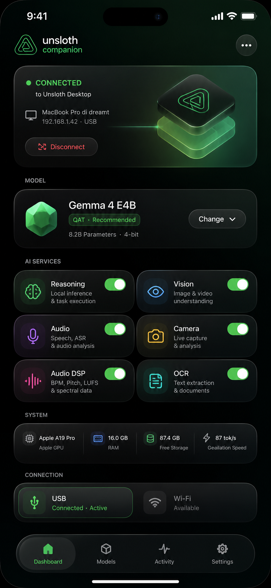

# Unsloth Companion open prototype

Unsloth Companion turns one or more iPhones into private, local co-processors for
an offline LLM application. The desktop model remains the orchestrator, owns the
conversation and decides what to delegate; paired phones run independent text,
OCR, vision, video, audio, and deterministic DSP jobs and return typed results.

This release is deliberately labeled a **prototype**. It demonstrates a practical
architecture and ships the complete implementation and documentation so other
developers can adapt the same pattern to their own offline LLM apps. It is not an
official Unsloth mobile product.



## Why this exists

Many people already own capable phones that sit idle for hours, especially while
charging overnight. A local orchestrator should be able to reuse those devices as
a small household edge cluster instead of requiring another PC, GPU, or server.

The prototype combines three reusable ideas:

1. **Model-aware context compaction** keeps long local chats inside the active
   model's actual context budget and repeats fitting before every model pass.
2. **A persistent objective and checklist** preserves the current task across
   compaction and requires genuine progress or a changed strategy.
3. **Phone companions** expose authenticated, capability-advertised workers. The
   orchestrator can choose the best phone or distribute independent tasks and
   shards across several devices while keeping a local Mac fallback. Submission
   returns immediately; the Mac continues independently and later collects completed
   work from a mailbox scoped to the originating chat.

Read [VISION.md](docs/VISION.md) for the longer-term idea: mixed generations of
iPhones, a future Android worker, overnight task queues, and future image or other
media generation when mobile runtimes make it practical.

## What is included

- `Unsloth Companion/`: native SwiftUI iPhone app, unit tests, and UI tests.
- `protocol/`: versioned JSON Schema and cross-language fixture.
- `config/model-registry.json`: pinned GGUF profiles with immutable revisions,
  byte sizes, and SHA-256 digests.
- `scripts/build_llama_xcframework.sh`: reproducible `llama.xcframework` build
  from pinned llama.cpp commit `3173a56471c1753650cd806694145ffd6dcace67`.
- `scripts/build_unsigned_ipa.sh`: unsigned, arm64 iPhone IPA packaging.
- `scripts/test_desktop_companion.py`: protocol, pairing, asynchronous mailbox,
  scheduling, task, cancellation, and real loopback WSS tests for the desktop manager.
- `docs/`: architecture, security, product, UX, pipelines, verification, vision,
  and a framework-neutral integration guide.
- Desktop integration under `studio/backend/core/companion`,
  `studio/backend/routes/companion.py`, and the corresponding Studio frontend.
- Context compaction and objective/checklist implementation under
  `studio/backend/core/inference` and `studio/frontend`.

AiryWay was inspected locally as a read-only architecture reference. It is not
modified, copied into this tree, or required at runtime.

## Architecture at a glance

```text
offline desktop LLM
  conversation + compaction + objective/checklist
  scheduler + fallback + result validation
                    |
          authenticated local WSS
                    |
       +------------+------------+
       |                         |
  iPhone worker A            iPhone worker B ...
  local GGUF/runtime         local GGUF/runtime
  one task or shard          another task or shard
```

A single generation and its KV cache are never split across phones. Parallelism
comes from independent subagent tasks, frames, chunks, batches, or shards. This
boundary makes the system useful without pretending that heterogeneous phones are
one shared-memory accelerator.

## Implemented behavior

- Bonjour discovery via `_unsloth-cp._tcp.` and local WSS.
- P-256 identity, certificate pinning, six-digit SAS, and confirmation on both
  devices before accepting work.
- Automatic best-device selection and optional multi-iPhone routing.
- Asynchronous `submit` plus non-blocking `status`/`collect`: iPhone inference
  never holds the Mac model's tool loop open, and stopping the Mac turn does not
  implicitly cancel already-dispatched phone work.
- llama.cpp/Metal runtime and real `mtmd` capability probes.
- Typed task protocol, leases, heartbeats, cancellation, replay protection,
  checksums, backpressure, and late-result handling.
- Journaled storage, strict budgets, GGUF deduplication, crash recovery, and
  automatic/manual cleanup.
- Foreground-only service availability. Locking or backgrounding the app drains
  work and performs cleanup; the prototype does not misuse iOS background modes.
- Mac-side output-budget selection and fallback when a phone cannot fit or finish
  a generation cleanly.

## Prototype limits

- The current Xcode project targets iOS 18.6. "Reuse older phones" means devices
  that still meet the configured OS, memory, storage, thermal, and model limits;
  it is not a promise that every old iPhone can run every model.
- The iPhone app must remain foregrounded and unlocked while serving tasks.
- The unsigned IPA requires the user to supply a valid signing identity before
  installation.
- Physical validation is partial. A signed build was installed and a resumed
  61.8 MB transfer was verified, but the full five-model smoke/stress matrix has
  not been completed. See [IMPLEMENTATION_STATUS.md](IMPLEMENTATION_STATUS.md).
- Android, USB transport, cloud inference, and image diffusion generation are
  future directions, not features of this release.

## Build and verify

The reference artifact was built with Xcode 27.0 and the iPhoneOS 27.0 SDK; the
project's minimum deployment target is iOS 18.6. Python dependencies used by
Studio and the JavaScript/Rust toolchains documented by the parent repository are
also required for the desktop build.

```bash
# Rebuild the pinned native runtime when needed.
./unsloth-companion/scripts/build_llama_xcframework.sh

# Run the desktop protocol and manager contract tests.
python3 unsloth-companion/scripts/test_desktop_companion.py

# Build an unsigned arm64 IPA into release/.
./unsloth-companion/scripts/build_unsigned_ipa.sh
```

Open `unsloth-companion/Unsloth Companion/Unsloth Companion.xcodeproj` to select
your own signing team and bundle identifier for a physical device build.

## Documentation map

- [Vision and design thesis](docs/VISION.md)
- [Integration guide for other offline LLM apps](docs/INTEGRATION_GUIDE.md)
- [Architecture](docs/ARCHITECTURE.md)
- [Protocol](protocol/PROTOCOL.md) and [JSON Schema](protocol/schema-v1.json)
- [Security and privacy](docs/SECURITY.md)
- [Multimodal pipeline](docs/MULTIMODAL_PIPELINE.md)
- [Product and UX specifications](docs/PRODUCT_SPEC.md) / [docs/UX_SPEC.md](docs/UX_SPEC.md)
- [Test plan](docs/TEST_PLAN.md) and [implementation status](IMPLEMENTATION_STATUS.md)
- [Historical subagent experiment](docs/SUBAGENT_EXPERIMENT.md)
- [Source and third-party notes](SOURCE_NOTES.md) / [THIRD_PARTY_NOTICES.md](THIRD_PARTY_NOTICES.md)
- [Licensing map](LICENSE.md)

## License

Licensing follows the parent repository and directory-specific license files. The
standalone Companion prototype is covered by the repository's Apache License 2.0;
Studio integration files carrying `SPDX-License-Identifier: AGPL-3.0-only` remain
AGPL-3.0-only. The bundled llama.cpp framework is MIT-licensed. See
[LICENSE.md](LICENSE.md) and [THIRD_PARTY_NOTICES.md](THIRD_PARTY_NOTICES.md).
